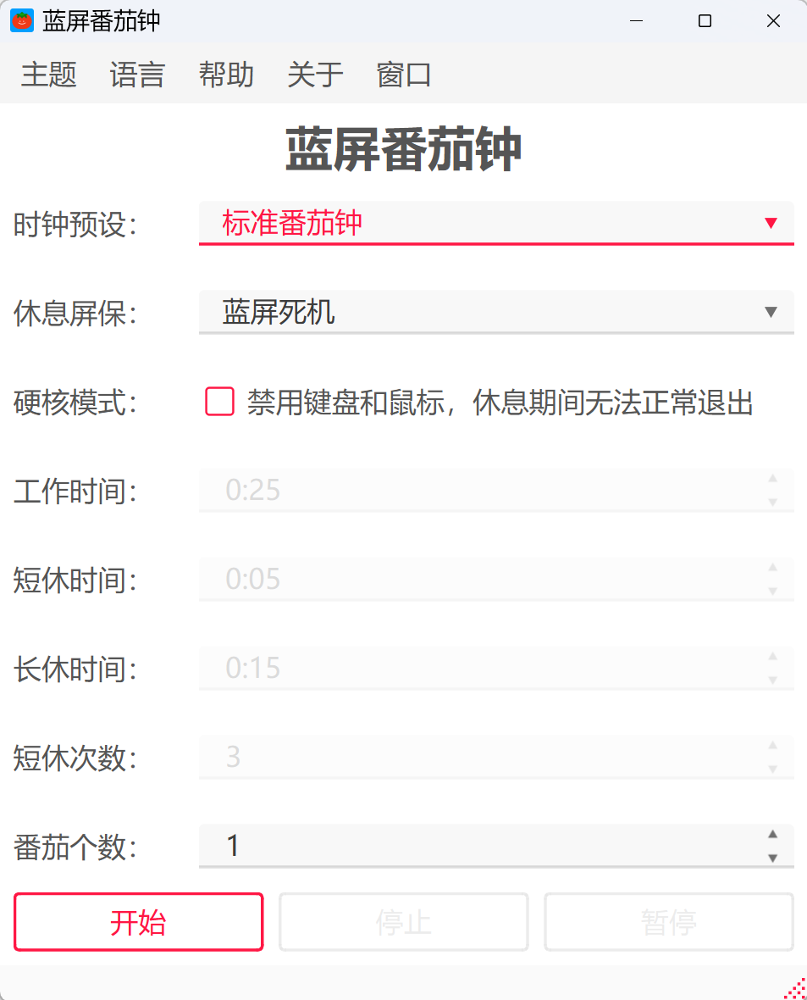
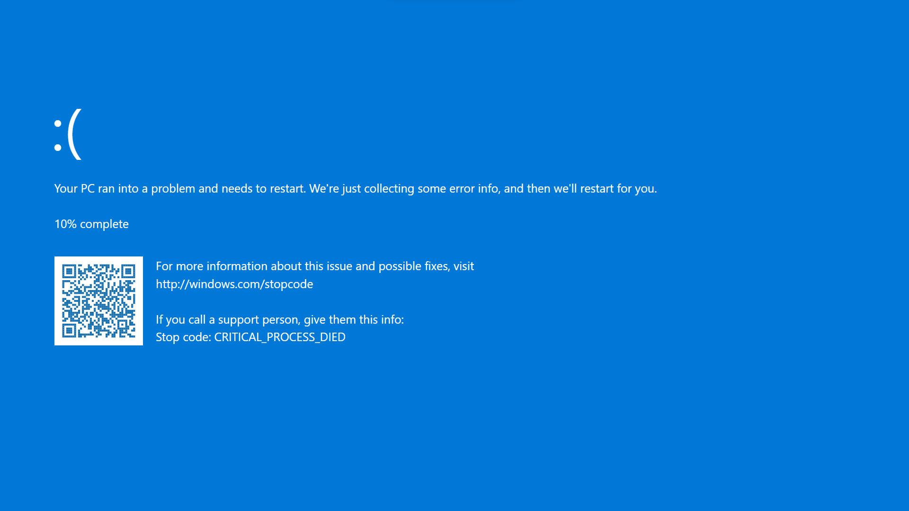
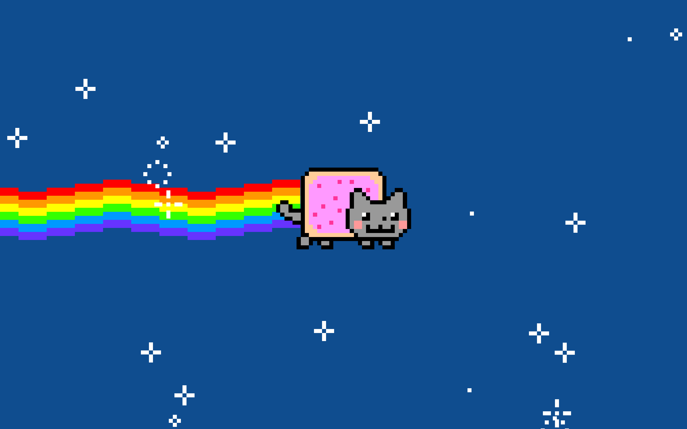

<div align="center">

</div>

<h1 align="center">BSOD Pomodoro</h1>

English | [简体中文](./README.md)

**A pomodoro timer that can "fake a crash": during breaks it can disguise itself as a Blue Screen of Death, the Nyan Cat virus, or simply show a normal reminder — so your rest is well justified and beyond the boss's reproach. It can also be used to prank a friend, making them believe the computer has really crashed.**

<br>

**Main Window:**

<div align="center">

</div>

**Blue Screen:**

<div align="center">

</div>

**Nyan Cat:**

<div align="center">

</div>

## 📖 Contents

- [✨ Features](#-features)
- [📥 Getting Started](#-getting-started)
- [🛠️ Usage](#%EF%B8%8F-usage)
- [🏗️ Project Architecture](#%EF%B8%8F-project-architecture)
- [🌍 Open Source Credits](#-open-source-credits)
- [⚖️ Disclaimer](#%EF%B8%8F-disclaimer)

## ✨ Features

- ⏱️ **Standard Pomodoro Timer**: a complete work / short-break / long-break cycle, with configurable short-break count and pomodoro count; the running status is shown on the status bar in real time.
- 🎭 **Disguised Breaks**: during breaks, the full-screen screensaver can disguise itself as a "Blue Screen of Death" or the "Nyan Cat" virus GIF animation; a normal popup + system notification is also supported.
- 😈 **Prank Your Friends**: the built-in prank mode can display the "Blue Screen of Death" or "Nyan Cat" virus screen for a long time, giving your friends a real shock. **Note**: never enable hardcore mode when pranking others; you assume full responsibility for any consequences.
- 🔒 **Hardcore Mode**: optionally locks the keyboard and mouse during breaks to force you to rest. Use it with great caution, and never on someone else's computer.
- 🗂️ **Presets / Customization**: ships with standard and prank presets; in custom mode, your own timer configuration is saved automatically.
- 🌗 **Light / Dark Themes**: switch between light and dark themes with one click.
- 🌐 **Bilingual UI**: fully internationalized interface; switch languages from the menu.
- 📌 **Tray Resident**: closing the window minimizes the app to the system tray and keeps the timer running in the background; the tray menu can restore the window or exit.
- 📦 **Out of the Box**: one command packages the app into a single-file, console-free standalone exe.

> [!WARNING]
> **Hardcore mode** disables the keyboard and mouse, and there is no way to quit normally during a break. You can use **Ctrl+Alt+Del** to bring up the system screen as an escape hatch.

## 📥 Getting Started

### Option 1: Download from Releases

Go to the [Releases page](https://github.com/HuaJi2077/bsod-pomodoro/releases), download the latest build and run it with a double click.

### Option 2: Run from Source

```bash
git clone https://github.com/HuaJi2077/bsod-pomodoro
cd bsod-pomodoro
uv sync
uv run python main.py
```

### Option 3: Build Your Own Package

```bash
git clone https://github.com/HuaJi2077/bsod-pomodoro
cd bsod-pomodoro
uv sync                              # Sync dependencies
uv run python script/build_qm.py     # Compile translation files (.qm)
uv run python script/build_exe.py    # Package a single-file exe
```

The build artifact is output to `output/BSOD_Pomodoro.exe`.

## 🛠️ Usage

1. **Choose a preset**: standard pomodoro / prank mode / custom. In custom mode you can freely adjust work time, short-break / long-break duration, short-break count and pomodoro count; changes are saved automatically.
2. **Choose a break screensaver**: blue screen of death / Nyan Cat / normal reminder.
3. **Hardcore mode** (locks the keyboard and mouse during breaks to force you to rest — **use with caution**).
4. **Start the timer**. While it is running you can pause / resume / stop, and the progress is shown on the status bar in real time.
5. **During breaks**, the selected screensaver is displayed full-screen (the normal reminder shows a modal dialog and sends a system notification); everything restores automatically when the break ends.

> [!TIP]
> Closing the window does not exit the app — it stays in the system tray and keeps counting. The tray menu can restore the window or truly exit.

## 🏗️ Project Architecture

A PySide6 desktop application based on a Presentation / Logic / Service three-layer architecture, with dependencies and the virtual environment managed by [uv](https://docs.astral.sh/uv/):

- **Dependency management**: dependencies are declared in `pyproject.toml`, and `uv.lock` pins exact versions, ensuring consistent builds across environments;
- **One-command sync**: `uv sync` automatically creates `.venv` and installs all dependencies — no manual pip needed;
- **Unified entry point**: all scripts (running, translation compiling, packaging) are executed via `uv run`, always within the project's virtual environment, avoiding environment pollution.

```text
User action
   │ widget signal
   ▼
logic/                     Logic layer: interaction control, state keeping, UI updates
   │ service.run(...)
   ▼
services/                  Service layer: timer scheduling, screensaver / input-lock wrapping
   │ signal (queued back to the main thread automatically)
   ▼
pages/                     UI layer: widget declaration and layout (no business code)
```

```text
Pomodoro_BSOD/
├── main.py                 # Entry: main window assembly, theme and language switching
├── pyproject.toml          # Dependency declaration (managed by uv)
├── uv.lock                 # Dependency version lock
├── pages/                  # UI layer (generated by Qt Designer)
├── logic/                  # Logic layer (pomodoro / tray / help)
├── services/               # Service layer (timer / screensaver / hardcore locking)
├── module/                 # Third-party screensaver modules (see credits below)
├── translate/              # Qt Linguist translation sources (.ts)
├── data/presets.json       # Presets and custom configuration
├── icon/                   # Icons and screenshots
├── script/                 # Translation compiling / packaging scripts
```

## 🌍 Open Source Credits

This project includes and adapts the following open-source repositories under [module/](./module). Many thanks to the original authors.

The copyright and license notices of each repository are preserved, and the original implementations have been packaged and partially modified.

| Module | Repository | License | Purpose |
| :-- | :-- | :-- | :-- |
| [module/blue_screen](./module/blue_screen) | [arpy8/bsod](https://github.com/arpy8/bsod) | [MIT](./module/blue_screen/LICENSE) | Blue screen screensaver |
| [module/nyan_cat](./module/nyan_cat) | [cristy-the-one/nyancat.py](https://github.com/cristy-the-one/nyancat.py) | [Apache-2.0](./module/nyan_cat/LICENSE) | Nyan Cat animation screensaver |

## ⚖️ Disclaimer

- This software is for personal study and lawful rest reminders only. **Do not use it for malicious damage, deception or harassment.**
- Hardcore mode locks the keyboard and mouse during breaks. Make sure you understand the risks before enabling it; although the app unlocks automatically on exit, use it with caution.
- You assume full responsibility for any consequences arising from the use of this software.

## 📜 License

This project is released under the [MIT License](./LICENSE). Feel free to use and build upon it.
